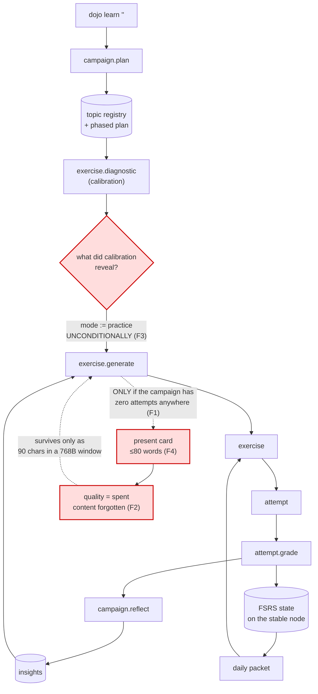
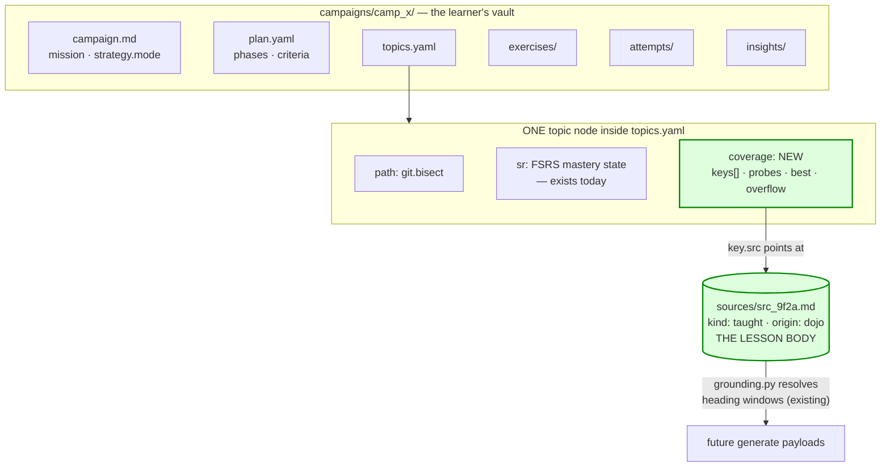
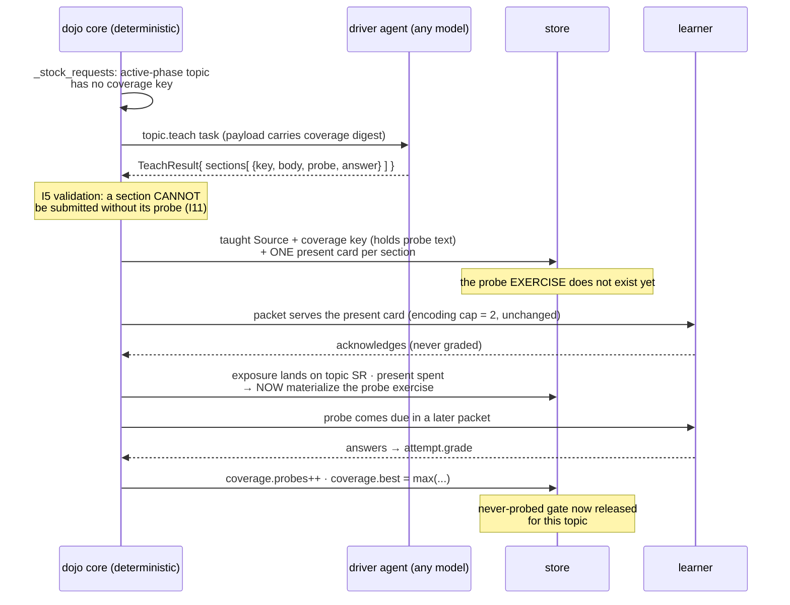
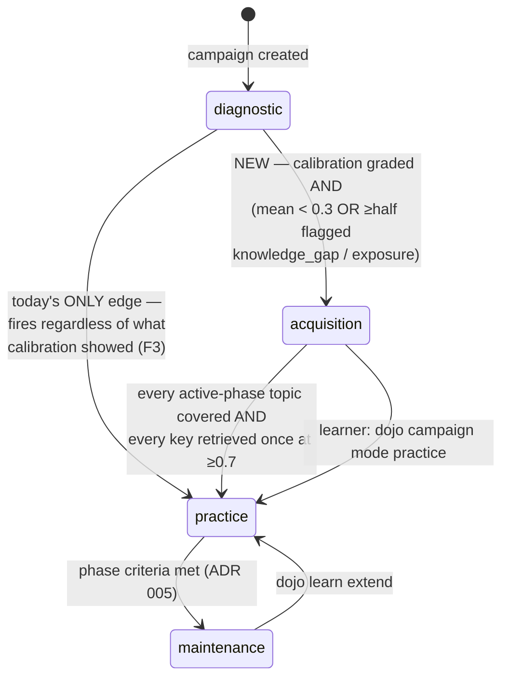
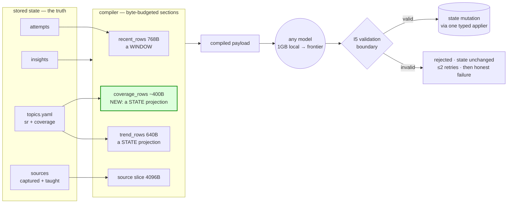
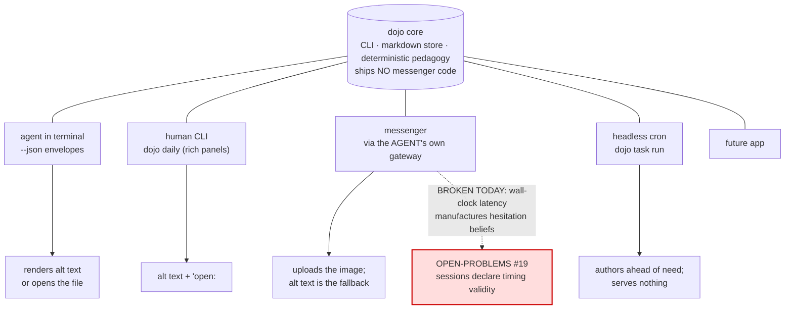

# Teaching, coverage, and rich content — investigation & proposal

_Status: **PROPOSAL awaiting owner gate** (directed 2026-07-28: "rethink from
first principles what the best way is to increase the scope of this so that it
can actually teach things, and know what it has taught the user"). Nothing here
is authoritative until the owner opens the gate. No `src/` change accompanies
this doc._

_This proposal REOPENS three recorded rejections — ADR 017's "lesson/explainer
entities or teaching task kinds", ADR 017's tool-calling rejection, and
QUESTIONS 6j's link-enrichment ruling. §2 and §8 engage each by name. A design
that quietly contradicts a decided ADR is a method violation; this one argues._

---

## 0. The architecture in six pictures

_Added 2026-07-29 at the owner's request. This section is the executive view;
the sections after it are the argument. Nothing here is new design — every
diagram is a projection of §1–§6._

### 0.1 — Today's loop, and the two breaks in it

Everything below the dotted line already exists and works. The two red nodes
are the whole problem: teaching is reachable once per campaign lifetime, and
what it produced is thrown away.



### 0.2 — Where the new state lives (one file, one node)

Coverage sits **beside** mastery state on the stable node — same place, same
anti-bloat argument (ADR 012): bounded by the syllabus, not by practice
history. The lesson body is a Source, so it is groundable by machinery that
already exists.



### 0.3 — The teach lifecycle, and why the probe waits

This is the subtle one. A probe built from taught material is `grounded`, so
its first miss is a **real lapse** — correct only once the presentation has
actually been served. So the probe *text* is recorded at apply time (the
obligation, I11) but the probe *exercise* does not exist until the present card
is spent. An exercise the learner cannot fairly be asked never exists.



### 0.4 — Mode: one new value, deterministic edges

`strategy_profile.mode` already carries `diagnostic → practice` with a
deterministic transition. `acquisition` is a third value in the same machine —
no new mechanism, and the dashed edge is the one that exists today and
discards the calibration result.



### 0.5 — What the model actually sees (unchanged discipline)

The core computes; the model judges. Coverage reaches a model the same way the
trend digest does — as a byte-budgeted **projection of state**, never as more
history, and never as something the model has to remember.



### 0.6 — Surfaces: why "works on Telegram" needs no Telegram code

Dojo ships no messenger code and should not (ADR 003). The agent uses its own
gateway and drives the CLI. What makes that work is one invariant: **every
asset carries text sufficient alone (I13)**, so each surface renders what it
can and loses no pedagogy.



---

## 1. The gap, measured

The owner's statement: the system is "**extremely** exercise-centric", and when
a learner wants to be trained on something they know nothing about, there is a
gap in how the system handles it. Four mechanical facts locate that gap
precisely.

**F1 — Dojo can teach exactly once per campaign, at birth, and never again.**
`tasks/compiler.py:395` gates the encoding-stage fragment on
`not attempts and not source_slice and registered` — the campaign must have
**zero attempts anywhere**. After the learner's first answer, ever, on any
topic, `encounter_no_present.md` fires for on-topic work and the empty string
otherwise. ADR 017 gave the generator a legal `present` move; the compiler
branch that invites it is reachable for one generation per campaign lifetime.
Every subsequent topic in an 18-topic syllabus is introduced by being tested.

**F2 — What was taught is not state; it is a 768-byte recency window.**
A served `present` lands `quality="spent"` (`outcomes.py:118`). Its content
survives only in `recent_rows` — 8 rows, topic-scoped, 768 B budget,
presentations clipped to 90 characters (`compiler.py:30,226,258`). ADR 017 §3
labelled this "a WINDOW, not the whole record" and was right to. But a window
structurally cannot answer *"what have I taught this learner, across
generations?"* — the question the owner is asking. On day 30 of a campaign, the
generator's view of everything ever presented on a topic is the last eight
attempt rows.

**F3 — Calibration measures the learner's level and nothing consumes the
measurement.** `api.py:2454` clears `strategy_profile["mode"] = "diagnostic"`
on phase-1 advancement, unconditionally. A learner who answered every
calibration question correctly and a learner who answered "I don't know" to
all of them arrive in exactly the same state: `mode="practice"`, generation
asking for exercises. **This is the gap, stated in one sentence: dojo detects
that the learner knows nothing and then behaves identically to the case where
they know everything.** ADR 017 made the resulting misses *free*; it did not
make the system *respond* to them.

**F4 — Teaching capacity is capped at a flashcard.** `GENERATE_ANSWER_WORDS =
80` (`limits.py:24`) bounds a `present` card's material. Eighty words is a
definition, not an explanation. Nothing in the system can hold a worked
example, a three-step procedure with its failure modes, or a reference sheet —
the artifacts `pedagogy-foundation.md` §"Short lessons, compact references,
durable records" explicitly requires.

**Not the gap: the encoding cap.** `DEFAULT_ENCODING_CAP = 2` (`packet.py:28`)
looks like the throttle and is not. Two encoding events per day over a
12-topic syllabus is one introduction per topic per six days — which is
correct spacing, not starvation. The blocker is F1 (teaching cannot recur) and
F2 (teaching is not remembered), not the rate. **This proposal does not raise
the cap.** That matters: ADR 017's pricing argument ("encoding is a promise of
future reviews; the cap prices that promise") survives intact, and I3
non-bombardment is untouched.

---

## 2. The doctrinal conflict, and how it resolves

Two authoritative documents disagree.

- **ADR 017 §Rejected alternatives:** "**Lesson/explainer entities or teaching
  task kinds** — token spend + drift from retention-first; the exercise
  `answer` is the kernel."
- **`pedagogy-foundation.md` §Short lessons, compact references, durable
  records:** "Dojo should preserve what matters in durable product surfaces:
  **References** — compact, source-backed summaries, glossaries, maps,
  algorithms, fact sheets, or checklists for review."

Both are authoritative and unamended. The resolution is not to pick a side but
to see what ADR 017 was actually defending against, and to give that defence a
sharper weapon.

ADR 017 was written from one field failure: a campaign whose exercises tested a
taxonomy no surface had ever presented. Its fix — miss-is-free plus a `present`
move — is sufficient for **gap repair inside a campaign where the learner
already has partial knowledge**. It is not sufficient for **acquisition from
zero**, which is the case the owner is naming. The rejection's stated reason,
"drift from retention-first", identifies the real hazard: an explainer surface
that *substitutes* for retrieval. It does not indict an explainer surface that
*creates* retrieval.

So the resolution is a single doctrine sentence, and it becomes the invariant
that governs everything below:

> **Teaching is not a second product. It is the act of creating a retrieval
> obligation, and it is paid for out of the same bounded budget as practice.**

Under that sentence, ADR 017's rejection stands as written for free-floating
explainer prose, and the pedagogy foundation's reference requirement is
satisfied — because every reference artifact this design can produce is born
with its probes attached, scheduled, and counted.

---

## 3. New invariants

Stated in blueprint §4's register; each is testable, and §5 argues each.

- **I11 — No teaching without retrieval debt.** Every teaching artifact
  registers at least one scheduled retrieval on the topic node at the moment it
  is applied. A teaching surface that produces no scheduled retrieval cannot
  exist. *(Enforced structurally: the result schema cannot express a taught
  section without its probe — §4.C.)*
- **I12 — Coverage is state, not memory.** The system can answer "what has been
  taught on this topic, when, and has it been retrieved since" from stored
  state, deterministically, at any age of the campaign — never from a model's
  recollection and never from a truncatable window.
- **I13 — Media degrades to text.** Every non-text asset carries a text
  equivalent sufficient to serve its pedagogical purpose alone. No learning
  value exists only inside a binary. *(This is what makes the content surface-
  neutral for free, and what keeps I4's offline floor intact.)*

---

## 4. The design — four parts, one new concept: none

Blueprint §3 says "eight concepts, no more". This design adds **zero**. It
extends three existing ones (Source, Topic, Exercise) and adds one task kind.
That is the strongest evidence available that the shape is right: the gap was
a missing *edge* between concepts dojo already has, not a missing concept.

### A. Coverage state on the stable node (the spine)

`Topic` is already the attachment point for mastery state, and ADR 012's
anti-bloat argument turns on exactly that: state attached to the stable node is
bounded by the size of the syllabus, not the practice history. Coverage state
goes in the same place, in `topics.yaml`:

```yaml
- path: git.bisect
  kind: skill
  sr: {due: …, stability: …}          # unchanged: mastery state
  coverage:                            # NEW: what the system has taught here
    keys:
      - k: bisect_run                  # ≤ COVERAGE_KEY_WORDS (6), a stable label
        src: src_9f2a                  # taught Source holding the full content
        at: 2026-07-20T08:00:00Z
        probes: 2                      # graded retrievals since it was taught
        best: 1.0                      # best graded score since it was taught
      - k: good_bad_marking
        src: src_9f2a
        at: 2026-07-22T08:00:00Z
        probes: 0
        best: null
    overflow: 0                        # keys dropped past the cap (I10 honesty)
```

Bounded by construction: `COVERAGE_MAX_KEYS` (proposed 12) × `PLAN_MAX_TOPICS`
(18) short strings per campaign. Overflow is counted and surfaced, never
silent.

It reaches models the way ADR 017 §6's trend digest does — **the core computes,
the model judges** — as a new compact section on `exercise.generate`,
`topic.teach`, and `campaign.reflect` payloads:

```
## TAUGHT (this topic)
bisect_run · 3d ago · probed 2× · best 1.0
good_bad_marking · 1d ago · NEVER PROBED
## NOT TAUGHT YET (active phase)
git.bisect_skip
```

Budget: `coverage_rows` ≈ 400 B at tier standard, clipped like every other
section, oldest-first (recent teaching is what generation needs).

**Two things this unlocks that a window cannot:**

1. Generation can probe what was actually taught, at any campaign age — the
   owner's "generating exercises based on what it has taught".
2. **ADR 017 §5's generator *guidance* becomes a code-enforced gate.** ADR 017
   asked models to "never introduce new material while a presented artifact
   awaits its first successful retrieval". With coverage state that becomes a
   deterministic predicate in `_stock_requests`: a topic holding a key with
   `probes == 0` requests **probes, not teaching**. Blueprint §12 rejects
   "prompt-enforced invariants" as a category; this converts one.

### B. Acquisition mode (the response to F3)

`strategy_profile.mode` already carries `diagnostic → practice` with a
deterministic transition (`api.py:2454`). Add a third value, `acquisition`,
with deterministic entry and exit — the same shape, no new machinery.

**Entry**, evaluated exactly where the diagnostic stamp clears today:

```
calibration produced graded evidence, AND
  mean graded score < ACQUISITION_ENTRY_SCORE (0.3)
  OR ≥ half the calibration attempts carry knowledge_gap / grader="exposure"
⇒ mode := "acquisition", announced once in daily, in plain language
```

This respects ADR 017's rejection of "forced pretest/study ceremony": nothing
is added to the learner's path. The calibration they *already did* decides, and
a learner with prior knowledge never enters the mode. The announcement is I9
honesty — "you told me this is new ground, so I'll teach before I test" — and
`dojo campaign mode practice` is the one-word exit if they disagree.

**What changes in the mode** — deliberately, only two things:

1. `_stock_requests` prefers `topic.teach` over `exercise.generate` for
   active-phase topics with no coverage.
2. `_compose_for_campaign` prefers **probes of just-taught keys** for the
   non-encoding slots. The testing effect is strongest at a short first delay;
   a packet of *teach 2 · probe-what-was-taught-yesterday 2 · review 1* is the
   acquisition loop, and it fits inside cap 5 with `encoding_cap` unchanged at 2.

**Exit**, deterministic and symmetric:

```
every active-phase topic has ≥1 coverage key, AND
every coverage key has ≥1 graded retrieval at ≥0.7
⇒ mode := "practice", announced once
```

Taught, and stuck at least once. Nothing else claims acquisition is finished.

### C. Teaching artifacts: a taught Source, and one new task kind

**The compression that keeps the concept count at eight: a presentation is a
Source that dojo authored.** ADR 001 already unified sources as "trusted
material with provenance, any size, whose heading hierarchy is its topic
outline"; blueprint §3 already admits a one-sentence capture as a Source. A
lesson is the same object with a different author.

Consequences, all of which are existing machinery doing its existing job:

- Taught content is **durable and readable** in the learner's vault
  (`sources/src_<id>.md`, `kind: "taught"`, `origin: dojo`), which is what
  `pedagogy-foundation.md`'s "references" requirement asks for.
- It becomes **groundable**: `tasks/grounding.py` already resolves heading
  windows into `source_section`, so later generations probe the real taught
  text rather than re-inventing content. F2's "models re-invented content per
  exercise" (ADR 017's own stated root cause) closes properly.
- Items generated from it are `provenance: "grounded"`, so `first_encounter`
  returns False (`outcomes.py:32`) and a miss is a **genuine lapse** — correct,
  because we taught it. The encoding semantics need no amendment.

**The task kind.** Two options were weighed:

| | Extend `exercise.generate` | New `topic.teach` kind |
|---|---|---|
| New template/corpus/holdout | none | one of each |
| Rule density | adds a 3rd job to the most rule-dense template | single-job call |
| Measured risk | **the compositional-load floor** — INSIGHTS 2026-07-25/26 (CKEY): fixes to one op relocate as failures in another when a call carries composed jobs | the model-strength-neutrality win (`reflect-decomposition.md` §1) |
| Token cost | pays lesson-sized output on every generate | pays it only on coverage gaps |

The repo's own measured evidence decides this: the prompt-lab's CKEY arc closed
with the finding that composed jobs relocate failures rather than fixing them,
and the reflect-decomposition investigation reached the same conclusion from
the other end. **Recommendation: a dedicated `topic.teach` kind.** ADR 017's
"token spend" objection is answerable now in a way it was not then — a teach
call *replaces* the generate call on that topic, fires only on a coverage gap,
and is bounded over a campaign's life by the syllabus size (≤ ~18 first-teach
calls, plus re-teaches on repeated failure).

**The result schema — where I11 becomes structural rather than prompted:**

```python
class TaughtSection(BaseModel):
    key: str        # ≤ COVERAGE_KEY_WORDS (6) — becomes the coverage key
    body: str       # ≤ TEACH_SECTION_WORDS (150) — the material itself
    probe: str      # ≤ GENERATE_PROMPT_WORDS — ONE retrieval question on it
    answer: str     # ≤ GENERATE_ANSWER_WORDS — its answer

class TeachResult(BaseModel):
    title: str
    sections: List[TaughtSection]      # 1 .. TEACH_MAX_SECTIONS (3)
    assets: List[Asset] = []           # capability-gated, §4.D
    note: Optional[str] = None
```

A section **cannot be expressed without its probe**. That is I11 enforced at
the I5 validation boundary — not a rule a weak model might drop, a shape it
cannot submit. It is also the direct answer to ADR 017's "drift from
retention-first" objection: drift is unrepresentable.

**The applier** (one path, idempotent per task id, like every other):
writes the taught Source; registers one coverage key per section on the topic
node, carrying that section's `probe`/`answer` text; creates one `present`
exercise per section (material = `body`) through the existing candidate gate
(I2 unchanged); stamps `generation_run` for provenance.

**The ordering constraint — the design's sharpest edge, closed.** A probe
generated from a taught Source is `provenance: "grounded"`, so
`first_encounter` returns False (`outcomes.py:32`) and its first miss is a
genuine lapse. That is correct **only after the presentation has actually been
served**. If the applier created the probe exercise in the same transaction as
the present card, the packet could schedule the probe first — the encoding cap
defers presentations, probes are not capped — and the learner would be
lapse-graded on material never shown: **precisely the ADR 017 field failure
this design exists to honor.**

So the probe is not an exercise until its presentation is spent. The probe text
lives on the coverage key from apply time (I11 is satisfied at the validation
boundary — the obligation is recorded the moment teaching is accepted), and the
probe *exercise* is materialized deterministically by the present-spend path
(`outcomes.land_score`, which already spends presentations and already runs for
every final score — two callers, one truth). An exercise the learner cannot
fairly be asked therefore never exists in the store.

*(Alternative considered and rejected: create both up front and filter unspent
probes out of `_due_exercises`. It works, but it needs a new quality value and
a new packet filter to protect an invariant that materialization enforces by
construction — and blueprint §12's doctrine is that anything which must be
true is made unrepresentable, not guarded.)*

`TEACH_SECTION_WORDS = 150` × 3 answers F4 — enough for a worked example with
its failure modes, still bounded, still nowhere near a payload.

### D. Rich content: pre-fetched, capability-negotiated, text-first

The owner's ask: a capable driver agent should be able to search the web, grab
information, make images, and have that ride into lessons and exercises — on
every surface, messengers included.

**What stays rejected, and why the rejection is not in the way.** QUESTIONS 6j
rejected the strong form — payloads carrying only a link, fulfiller fetches at
generation time — on four grounds (offline floor, model-strength neutrality,
provenance, ADR 009/010 injection surface). All four still hold. ADR 017
rejected tool-calling *inside* the task contract for token-multiplication and
weak-model-loop reasons. Also still holds.

**The form that is neither, and is already shipped doctrine.** At capture time,
the driver already fetches and dojo already stores the result as a Source with
a `locator` (SKILL.md §Remember something; QUESTIONS 6g, validated live). The
proposal is one sentence: **apply the same pattern to teaching — enrichment
happens before the task, lands as stored content with provenance, and never
happens inside the task contract.**

Concretely, when a store declares fulfiller capabilities:

- `fulfiller.capabilities: [web, images]` — a config list the *agent* sets once
  (it knows what it can do; dojo cannot detect it). Default empty ⇒ the
  compiler renders nothing extra and **payloads stay byte-identical**, the same
  discipline as `fulfiller.anchor_profile` and `route_skeleton`.
- The teach payload gains one capability fragment: material you consult must be
  submitted as a source with its locator; material you generate (a diagram, an
  image) must be submitted as an asset with alt text. Compiler-branched on
  config, never model judgment (craft rule 5).
- `TeachResult.assets[]`: `{path, alt, kind, locator?}` where the driver has
  written the file and dojo copies it in.

```python
class Asset(BaseModel):
    path: str                                    # driver-written file
    alt: str = Field(min_length=1)               # REQUIRED — I13
    kind: Literal["image", "audio", "diagram", "file"]
    locator: Optional[str] = None                # where it came from, if fetched
```

**Store rules** (this is the part that touches ADR 018's vault-grade layout, so
it needs stating precisely):

- Content-addressed: `assets/<sha256>.<ext>`, referenced from bodies as
  standard markdown (``) so an Obsidian vault
  renders it and the 6f vault projection needs no special case.
- `ASSET_MAX_BYTES` (proposed 2 MB) and a per-campaign total (proposed 50 MB),
  refused honestly past the cap and counted (I10). Small caps are what keep git
  versioning viable without LFS; `dojo doctor` reports asset weight.
- **Assets never enter payloads** (I6). A task references a path; a driver that
  needs to see the image reads the file itself — it has filesystem access, and
  that is why this composes with grading image-based exercises for free.
- `dojo export` copies assets; a store with zero assets is byte-identical to
  today's.

**The line that keeps `extract-never-enrich` intact:** that standing directive
governs the *learner model* — the system learns the user's words, never AI
embellishment. It is untouched here. Enrichment of *teaching content* is a
different axis and is permitted only when it lands in a Source, with a locator,
under the review gate. Nothing fetched ever becomes a belief about the learner.

---

## 5. Correctness arguments

**I11 (no teaching without retrieval debt).** Teaching artifacts enter state
through exactly one path: `topic.teach` submission → validation → the teach
applier. `TeachResult` cannot represent a section without a probe, so a
validated payload always carries ≥1 probe per section; the applier creates the
probe exercise in the same transaction as the present card and the coverage
key. Therefore a taught key with no scheduled retrieval is unreachable, not
discouraged. *Pinned by:* applier tests asserting `probes_created ==
len(sections)`; a fuzz test over invalid `TeachResult`s asserting the store
hash is unchanged; a property test asserting every coverage key has a
corresponding live exercise.

**I12 (coverage is state).** Coverage lives on the topic node in `topics.yaml`,
which round-trips through the same conformance suite as every other entity
(I7). It is written only by the teach applier and updated only by the score
landing path (`outcomes.py`, which already runs for every final score — two
callers, one truth). It is never derived from a truncatable section, and the
digest that reaches models is a *projection* of it. *Pinned by:* round-trip
property tests on the new field; a test asserting `probes`/`best` advance on
graded retrievals of the probing exercise and do **not** advance on
`grader="exposure"` rows (a topic must never look covered-and-retrieved off
encodings — the same discipline `trend_rows` already applies).

**Boundedness.** `COVERAGE_MAX_KEYS` × `PLAN_MAX_TOPICS` bounds coverage state
at ~216 short records per campaign, independent of practice history. ADR 012's
anti-bloat argument is preserved verbatim: state attaches to the stable node.
Overflow drops oldest and increments `overflow`, surfaced in `doctor`/`stats`.

**I3/I8 (non-bombardment, determinism) are untouched.** The encoding cap does
not move; `build_packet`'s single clamp remains the only assembler; acquisition
mode changes *preferences inside* `_compose_for_campaign`, which is already a
pure function of store state + clock + seeded tie-break. *Pinned by:* the
existing property tests, extended with acquisition-mode fixtures asserting
`len(packet) ≤ cap` and identical state+date ⇒ identical packet.

**I4 (offline floor).** With no fulfiller: teaching cannot be authored, and
that is reported honestly ("2 teach slots skipped: no fulfiller"), exactly as
generation is today. Already-taught Sources keep serving and their probes keep
coming due — the offline floor is *stronger* after this change, because taught
content is durable state rather than a spent card.

**I13 / model-strength neutrality.** Capability fragments are compiler-appended
on config; a store that never sets `fulfiller.capabilities` produces
byte-identical payloads to today's, so a 1 GB local model is unaffected. A
capable driver's assets always carry alt text, so a *different* surface or a
later offline session loses no pedagogy. The asymmetry that would break
neutrality — content only a strong model can produce being content only a
strong model can serve — cannot arise.

---

## 6. Surfaces — the experience, and one real defect this audit found

Dojo ships no messenger code and should not (ADR 003; `project-roadmap.md`:
the agent uses its own gateways and drives the CLI). So "works on Telegram"
means: the envelope carries what a messenger-driving agent needs, and no
surface assumption is baked into the core. The matrix:

| Surface | Lesson card | Assets | Timing | Standing risk |
|---|---|---|---|---|
| Agent in terminal (`--json`) | prompt + `material` verbatim, `sections[]` one per packet slot | path + alt in envelope; agent renders if it can | measured | none |
| Human CLI (`dojo daily`) | rich panel; sections paced by the encoding cap | alt text + "open: `<path>`" hint (inline-image protocols: backlog) | measured | none |
| **Messenger via the agent's gateway** | one card per message; the encoding cap is a *feature* here — a lesson arrives as 2 cards/day, not a wall of text | agent uploads the image; alt text is the fallback and the accessibility text | **broken — see below** | must not nag: STATE item 2's "the system never solicits extra practice" binds this surface hardest |
| Headless cron (`dojo task run`) | authors teaching ahead of need; serves nothing | stored, not served | n/a | ADR 003b bounds pre-generation; teach requests are coverage-gap-gated, so no runaway |
| Future app | native | native | measured | none |

**The defect: async surfaces silently poison latency evidence.**
`api.py:1783` stamps `current_attempt_started_at` at `dojo ready` and
`api.py:1875` computes `latency = now - started_at` at `dojo answer`. On a
messenger, a learner may answer six hours later. Consequences, traced:

- *Scheduling:* benign. `rating_for` (`scheduling.py:44`) uses latency only to
  upgrade a perfect answer to `Easy`. A slow answer is never punished — an
  async learner just never earns `Easy`. Asymmetric, mild, honest-ish.
- *Reflection:* **not benign.** Reflect rows compile "topic · seconds ·
  error_tag" (`compiler.py:573-577`), the rushing carve-out reasons over
  fast-miss/slow-success, and DIAGVOICE branches on attempt quality. A row
  reading `21600s` invites a fabricated insight about hesitation or struggle
  from evidence that is really "the learner was at work". That is a belief
  about the learner, manufactured by a surface artefact — the exact class of
  dishonesty method §9 forbids.

Fix, in the owning layer: **sessions declare timing validity.** A
`PracticeSession.timing: "measured" | "untimed"` (set by `dojo daily
--untimed` or `surface.timing` config) makes attempts stamp
`latency_seconds: null` rather than a lie; the compiler renders `—` instead of
seconds; `rating_for` already handles `None` correctly. This is method §9's
"tag approximations" rule applied to a field that currently cannot say "I don't
know". Filed as OPEN-PROBLEMS #19 — it is a live bug independent of this
proposal, and it is a prerequisite for taking messengers seriously.

**Second surface check, resolved:** a `present` card requires acknowledgment
before it spends. Headless drains (`dojo task run`) never enter sessions —
they fulfil tasks only — so a present card cannot deadlock a cron run. No
change needed; recorded so the next session doesn't re-derive it.

---

## 7. What this design deliberately rejects

- **A `Lesson` entity.** A lesson is a taught Source plus its scheduled probes.
  A ninth concept would buy nothing and cost blueprint §3.
- **Model-authored curricula ("teach me everything about X" → 40 sections).**
  `TEACH_MAX_SECTIONS = 3` and the coverage-gap gate keep teaching demand-
  driven. Breadth belongs to the plan; delivery belongs to the packet.
- **Raising the encoding cap.** §1 shows it was never the blocker; ADR 017's
  debt-pricing argument stands.
- **Fulfiller-side fetching inside a task** (QUESTIONS 6j strong form) and
  **tool-calling in the task contract** (ADR 017) — both stay rejected, on the
  original reasoning. §4.D routes around them rather than through them.
- **Teaching that grades.** A `present` card is never scored (ADR 017); its
  probe is. Keeping those separate is what stops "teaching" from becoming a
  softer word for "testing".
- **A separate teaching *schedule*.** One packet, one budget, one clamp.
  Teaching competes with practice for slots and always will.

---

## 8. Costs, risks, and what must be measured

**Token cost.** A teach call's output is ~3 × (150 + 120 + 80) words ≈ 1 000
words, roughly 2–3× a generate response; its payload is comparable to generate
plus ~400 B of coverage rows. It fires on coverage gaps only, so a campaign's
lifetime teach spend is bounded by its syllabus (≤ ~18 first-teaches). Against
that: acquisition-mode campaigns stop burning generate calls on exercises the
learner cannot attempt, and F1's status quo spends grade calls on "I don't
know" answers. Net direction is arguable and **must be measured**, not asserted.

**Risks, honestly stated.**

1. *Prompt-surface growth.* One new template plus a coverage section on three
   existing ones. `campaign.reflect` is already at its byte ceiling
   (`reflect-decomposition.md` §1: five scenarios within 4–68 B of the cap).
   Coverage rows may not fit reflect without displacing something — mitigation:
   land coverage on `generate`/`teach` first, and treat reflect as a separate,
   evidence-gated decision.
2. *Holdout burn.* New pedagogy surfaces need holdout scenarios, authored blind
   under the CLAUDE_START protocol, and reflect-targeting holdout scenarios may
   need re-authoring if reflect's payload changes. This is a real, recurring
   cost of every pedagogy surface and the owner has already priced it once.
3. *Assets in a git store.* Caps and content-addressing bound it; the honest
   residual is that a learner who accepts many image lessons grows their repo.
   `doctor` surfacing weight is the mitigation, not a fix.
4. *Acquisition mode mis-entry.* A learner who sandbagged calibration gets
   taught things they know. Mitigations: the announcement is loud, the exit is
   one command, and `too_easy` skips already spend a present card as real
   evidence (`outcomes.py:118`).

**Evaluation plan** (owner ruling: every pedagogy surface is benchmarked).
New visible-corpus categories, shipped *with* the features, floors ratcheted:
teach-authoring (sections are teachable, probes actually probe *their* section,
key labels are stable); coverage-use (generation probes taught keys rather than
re-inventing; the never-probed gate is respected); acquisition transitions
(entry fires on a genuinely blank calibration and **not** on a mixed one — the
opposite-branch control the corpus discipline requires); asset discipline
(alt text sufficient alone; capability-off payloads byte-identical). Noise is
the test at every juncture: adversarial scenarios where a model tries to teach
without probing, or to claim coverage it never delivered.

---

## 9. Staging — the smallest useful slice first

Tagged per method §13. The owner gates each stage; nothing below is started
without that.

**NOW — Stage 1: coverage state, no new AI surface.** Coverage on the topic
node; the digest section on `exercise.generate`; the never-probed gate in
`_stock_requests`; coverage populated from the existing `present` path — **and
the F1 gate relaxed so that path can fire more than once per campaign.** That
last clause is load-bearing and was nearly left implicit: at `compiler.py:395`
as written, teaching happens once per campaign ever, so coverage state alone
would accumulate at most one key and the slice would not pay for itself. The
relaxation is compiler-only (invite a presentation when the *topic* has no
coverage, rather than when the *campaign* has no attempts) — no new task kind,
no new template, no holdout enrichment, and it is the same craft-rule-5 shape
the branch already has.

So stage 1 delivers recurrence plus memory: teaching can happen again, and what
was taught becomes durable, queryable state that generation probes. What it
does **not** deliver is depth — F4's 80-word ceiling stands until stage 2, so
stage 1 teaches in flashcards. That is a real limit, stated plainly rather than
smoothed over; the slice is still worth landing alone, because every later
stage depends on coverage state existing and none of it depends on the reverse.

**NEXT — Stage 2: `topic.teach` + acquisition mode.** The new kind, its
template and corpus, the applier, the taught-Source lifecycle, the deterministic
mode transitions. Gated on stage 1 showing coverage rows measurably improving
probe quality (the evidence gate ADR 017 asked for and never got).

**NEXT — Stage 3: capability profile + assets.** `fulfiller.capabilities`, the
asset store, `TeachResult.assets`, alt-text validation, doctor weight
reporting, export/vault handling.

**BACKLOG.** Inline-image terminal protocols; `--untimed` beyond the minimal
fix (per-surface timing profiles); teach-aware plan phases (`plan` stays
untouched deliberately — it is the most tuned template in the repo and this
design needs nothing from it).

**Independent of all stages — ship now:** OPEN-PROBLEMS #19, the async latency
fix. It is a correctness bug in shipped code, it is small, and every messenger
story depends on it.

---

## 10. Owner decisions (defaults stated; queued in QUESTIONS.md)

1. **Does teaching earn its own task kind?** Recommendation: yes, `topic.teach`
   (§4.C), on the repo's own compositional-load evidence.
   *Default if unanswered: stage 1 only — coverage state, no new kind.*
2. **ADR 017 supersession.** If stage 2 is gated open, ADR 017's
   "lesson/explainer entities or teaching task kinds" rejection is amended (not
   deleted) by a new ADR that records the doctrine sentence in §2 and the I11
   enforcement mechanism. *Default: no amendment without the gate.*
3. **Binaries in the store** (§4.D). *Default: not built; if built, 2 MB per
   asset / 50 MB per campaign, content-addressed, doctor-reported.*
4. **Acquisition-mode entry threshold** (`ACQUISITION_ENTRY_SCORE = 0.3`, or
   ≥ half the calibration attempts flagged). *Default: as stated, announced
   loudly, one-command exit.*
5. **Coverage rows in the reflect payload** — reflect is at its byte ceiling.
   *Default: excluded from stage 1; revisited as its own decision.*
