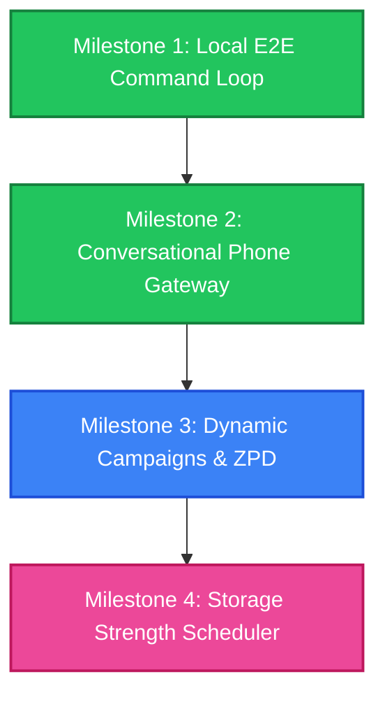

# Dojo Project Roadmap & Milestones

This document establishes the macro-level roadmap for the Dojo Learning System. 

---

---

## Milestone 1: Local E2E Command Loop (Completed)
*   **Goal:** Establish the local-first storage, CLI boundaries, and subprocess connectors. Ensure a learner can add a source, generate candidates, review/queue them, and run a basic practice session locally.
*   **Target Deliverables:**
    *   Unified storage schema for AI connectors, runs, sources, candidates, and exercises.
    *   `dojo connect ai` connector management.
    *   `dojo add --generate` for source-to-candidate ingestion.
    *   `dojo source review` CLI interactive console wizard.
    *   `dojo queue` & basic practice session loop (`start`/`ready`/`answer`).
*   **Resolution:** Implemented modular, local-first filesystem storage layer with Git versioning. Built CLI commands matching all required specifications.

---

## Milestone 2: Conversational Phone Gateway (Completed / Integrated)
*   **Goal:** Move practice from the computer terminal to the phone. Integrate Dojo with external agent frameworks to support mobile messaging and notifications.
*   **Target Deliverables & Resolution:**
    *   *Dojo core library API / daemon interface:* Integrated. The clean, JSON-capable CLI acts as the backend API.
    *   *Registering Hermes as an AI connector:* Integrated. The installer registers and configures `hermes` in the local connector config.
    *   *Hermes messaging adapter & practice loop:* Integrated via Operator Skill. Rather than custom network/SMS code in Dojo, the agent uses its native messaging gateways (WhatsApp/Slack) and follows the instructions in the `dojo` skill to drive the session via standard CLI commands on the backend.
    *   *Shared interaction port:* Integrated. The session-tracking schema ensures that state is kept synchronized on disk, allowing sessions to span multiple clients or channels safely.

---

## Milestone 3: Dynamic Campaigns & ZPD Calibration (In Progress)
*   **Goal:** Support unconstrained learning goals (e.g., "improve my memory") and make the study path dynamically adapt to user performance and comfortable difficulty.
*   **Target Deliverables:**
    *   Goal-oriented ingestion: Targeted diagnostic interviews instead of file uploads.
    *   Synthetic sources: AI-generated lesson plans and attack plan structures.
    *   Just-in-Time (JIT) candidate generation triggered by daily replenishment or session feedback.
    *   Adaptive ZPD scaling: shifting exercise generation parameters as user metrics change.
*   **Status:** Refactored campaign-scoped calibration and consolidated learner profiles via reflection runs. Prompts are organized as declarative skills executed via programmatic value injection.

---

## Milestone 4: Storage Strength Scheduler & Analytics (Planned)
*   **Goal:** Replace simple queues with a scientifically calibrated spaced-retrieval scheduler that optimizes for long-term storage strength.
*   **Target Deliverables:**
    *   Persistent learner profile capturing recall latency, error patterns, and self-ratings.
    *   Spaced-repetition scheduling algorithm (distinguishing fluency strength vs. storage strength).
    *   `dojo progress` & `dojo report` dashboards tracking gaps, retention rates, and atrophy metrics.
    *   **Architectural Constraints:** Distinguish between static fact repetition (fixed intervals) vs. procedural skill variation (generating novel items matching templates/patterns). Calibrate optimal novelty ratios and training frequency customized to the user's specific learning style and learning goals.

---

## Future Roadmap: Token Optimization & Unified Representations
*   **Goal:** Optimize context windows and LLM token usage for JIT execution via progressive disclosure and unified source representations.
*   **Target Deliverables & Tasks:**
    *   **Unified Source Representation:** Investigate and implement unifying syllabuses/campaigns and standard study sources under a single underlying `Source` model. Solving outline pruning and JIT retrieval for one will solve it for both.
    *   **Abstracted Progressive Disclosure:** Enable progressive context retrieval for the JIT engine. Instead of passing entire documents, pass pruned outlines and allow the JIT connector to query the files/sources dynamically (using CLI utilities like grep, semantic search, or selective retrieval) to fetch full text only when needed.
